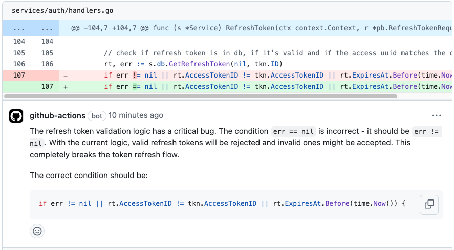
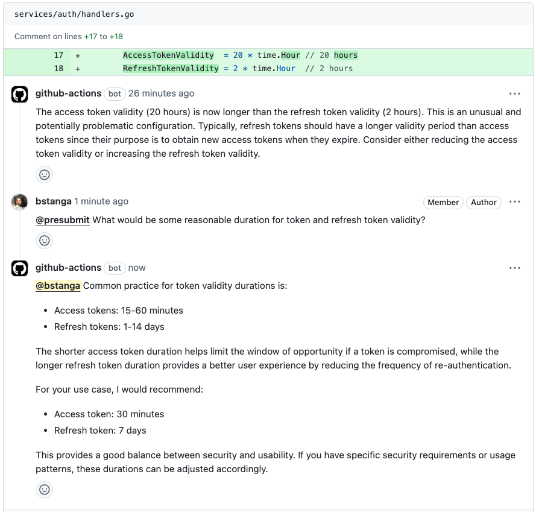

<div align="center">
  <h1>
    PR Review Static
  </h1>
  
  <p><em>Revisões de PR com análise estática</em></p>

[](https://github.com/thallesasv/pullRequestStaticCodeReview/stargazers) &nbsp;
[](https://github.com/thallesasv/pullRequestStaticCodeReview/commits) &nbsp;
[](https://github.com/thallesasv/pullRequestStaticCodeReview/blob/main/LICENSE) &nbsp;

</div>

<br/>

O PR Review Static faz revisão automática de pull requests usando Semgrep como motor de análise estática. Ele lê o diff do PR, identifica padrões de bug e segurança, gera um resumo do que mudou e publica comentários inline quando encontra pontos acionáveis.

- 🔍 **Análise de diff**: Examina apenas o código alterado no PR
- 🛡️ **Detecção de problemas comuns**: Busca sinais de bugs, vulnerabilidades e más práticas
- 📝 **Resumo automático do PR**: Gera um título e uma descrição consistentes com a mudança
- 💬 **Comentários inline**: Publica comentários de revisão diretamente nas linhas afetadas
- ⚡ **Sem dependência de LLM**: Não exige chave de API nem configuração de provedor externo
- 🧰 **Baseado em Semgrep**: Usa regras consolidadas de análise estática em vez de heurísticas manuais

<br/>

## Como funciona

O fluxo da action é simples:

1. A GitHub Action é acionada em `pull_request_target`.
2. O workflow faz checkout do repositório e instala o Semgrep.
3. O motor Semgrep processa os arquivos alterados do PR.
4. O sistema traduz os findings em comentários, score e resumo do PR.
5. O sistema publica o resumo e os comentários de revisão no próprio PR.

O modo de comentário em threads existe no código, mas responde com saída vazia no modo estático atual.

### Como a análise é feita


A análise estática usa o Semgrep no runner. O repositório apenas adapta a saída da ferramenta para o formato de review do GitHub. A integração principal está em [src/static-analysis.ts](src/static-analysis.ts) e [src/diff.ts](src/diff.ts).

O processamento segue este caminho:

1. O diff do PR é convertido em hunks com linha inicial e final.
2. O Semgrep varre os arquivos alterados com um conjunto de regras padrão.
3. A saída JSON é filtrada para manter apenas findings nas linhas alteradas.
4. Os achados viram comentários inline, score de qualidade, esforço estimado e resumo do PR.

As regras cobrem casos como SQL injection, XSS, segredos hardcoded, uso inseguro de APIs, código morto, problemas de manutenção e outras classes de findings suportadas pelo conjunto de regras do Semgrep.

## Veja em ação

> 💡 Veja um exemplo completo de revisão de PR nas imagens abaixo.

A análise automatizada detecta problemas potenciais e fornece insights acionáveis:

<div align="left">
  <a href="https://github.com/thallesasv/pullRequestStaticCodeReview/pulls">
    
  </a>
</div>

<br/>

Comentários de revisão ajudam a esclarecer detalhes de implementação:

<div align="left">
  <a href="https://github.com/thallesasv/pullRequestStaticCodeReview/pulls">
    
  </a>
</div>

<br/>

## Uso

### Passo 1: Crie o workflow do GitHub

Adicione esta GitHub Action ao seu repositório criando `.github/workflows/pr-review-semgrep.yml`:

```yaml
name: PR Review - Semgrep Static Analysis

permissions:
  contents: read
  pull-requests: write
  issues: write

on:
  pull_request_target:
    types: [opened, synchronize]

jobs:
  review:
    runs-on: ubuntu-latest
    steps:
      - uses: actions/checkout@v4

      - name: Install Semgrep
        run: python -m pip install semgrep

      - uses: thallesasv/pullRequestSemgrepCodeReview@main
        env:
          GITHUB_TOKEN: ${{ secrets.GITHUB_TOKEN }}
          SEMGREP_APP_TOKEN: ${{ secrets.SEMGREP_APP_TOKEN }}
          SEMGREP_CONFIG: ${{ secrets.SEMGREP_APP_TOKEN != '' && 'p/pro' || 'p/default' }}
```

A action requer:

- `GITHUB_TOKEN`: Fornecido automaticamente pelo GitHub Actions
- `SEMGREP_APP_TOKEN`: Segredo do Semgrep AppSec Platform. Quando presente, o workflow usa `p/pro`; caso contrário, cai para `p/default`

Para habilitar as regras Pro, crie o segredo `SEMGREP_APP_TOKEN` em **Settings > Secrets and variables > Actions** do repositório e cole o token gerado no Semgrep AppSec Platform.

Se você quiser que o Semgrep AppSec Platform publique comentários diretamente no PR, isso é um fluxo separado de `Managed Scans` e exige conectar o repositório ao Semgrep AppSec Platform além deste workflow.

### Suporte ao GitHub Enterprise Server

Se você usa GitHub Enterprise Server, pode configurar a action para funcionar com sua instância adicionando estas variáveis de ambiente:

```yaml
      - uses: thallesasv/pullRequestSemgrepCodeReview@main
        env:
          GITHUB_API_URL: "https://github.example.com/api/v3"
          GITHUB_SERVER_URL: "https://github.example.com"
```

Você também pode configurar essas opções usando parâmetros de entrada:

```yaml
      - uses: thallesasv/pullRequestSemgrepCodeReview@main
        with:
          github_api_url: "https://github.example.com/api/v3"
          github_server_url: "https://github.example.com"
```

Certifique-se de substituir `https://github.example.com` pela URL real do seu GitHub Enterprise Server.

<br/>

## Recursos

### 🤖 Revisões inteligentes

- **Análise estática**: Revisão linha a linha baseada no diff do PR
- **Resumo automático de PR**: Resumos concisos e relevantes das mudanças
- **Qualidade de código**: Detecta bugs, antipadrões e problemas de estilo
- **Comentários de revisão**: Gera comentários inline a partir de heurísticas do diff

### 🛡️ Segurança e qualidade

- **Detecção de vulnerabilidades**: Busca sinais de SQL injection, XSS, segredos hardcoded e desserialização insegura
- **Boas práticas**: Aplica regras simples de manutenibilidade e legibilidade
- **Performance**: Identifica possíveis gargalos e números mágicos
- **Documentação**: Destaca TODO/FIXME e comentários relevantes no diff

### ⚙️ Configurável

- Configure `GITHUB_API_URL` e `GITHUB_SERVER_URL` para GitHub Enterprise Server
- Ajuste a lógica de revisão editando `src/static-analysis.ts`

### ⚡ Integração sem atrito

- Configuração em poucos minutos com GitHub Actions
- Não requer chave de API nem configuração de provedor externo
- Feedback instantâneo em cada PR
- Zero manutenção de serviços externos

<br/>

## Testes locais com CLI (Dry-Run)

Execute o revisor localmente em PRs reais usando sua autenticação do GitHub.

### Pré-requisitos

- Node.js 18+
- GitHub CLI autenticado: `gh auth login`
- Arquivo `.env` opcional com `GITHUB_TOKEN=...` se você quiser evitar o `gh auth token`

### Build

```bash
pnpm install
pnpm build
```

### Comandos

**Listar PRs:**
```bash
pnpm review -- --list-prs --state open --limit 5
```

**Revisar um PR (dry-run):**
```bash
pnpm review -- --pr 123 --dry-run
```

**Salvar saída em arquivo:**
```bash
# Gera automaticamente o nome do arquivo: dry/pr-123.txt
pnpm review -- --pr 123 --dry-run --out

# Caminho de saída personalizado
pnpm review -- --pr 123 --dry-run --out my-review.txt
```

**Especificar repositório:**
```bash
pnpm review -- --pr 123 --owner myorg --repo myrepo --dry-run
```

Ou defina no `.env`:
```env
GITHUB_REPOSITORY=myorg/myrepo
```

### Observações

- Usa automaticamente seu `gh auth token`
- O modo `--dry-run` ignora todas as escritas na API do GitHub e registra o que seria publicado
- Sem `--dry-run`, a revisão será publicada no GitHub
- O padrão é o repositório da variável `GITHUB_REPOSITORY` ou `thallesasv/pullRequestStaticCodeReview`

<br/>

## Personalização

As regras de análise estão em [src/static-analysis.ts](src/static-analysis.ts). É ali que você pode ajustar os padrões detectados, a severidade dos comentários e a pontuação de qualidade.

## Mostre seu apoio! ⭐

Se você considera o PR Review Static útil para melhorar o processo de revisão:

- **Dê uma estrela neste repositório** para mostrar seu apoio e ajudar outras pessoas a descobri-lo
- Compartilhe sua experiência criando uma [GitHub Issue](https://github.com/thallesasv/pullRequestStaticCodeReview/issues)
- Considere [contribuir](CONTRIBUTING.md) para deixá-lo ainda melhor
